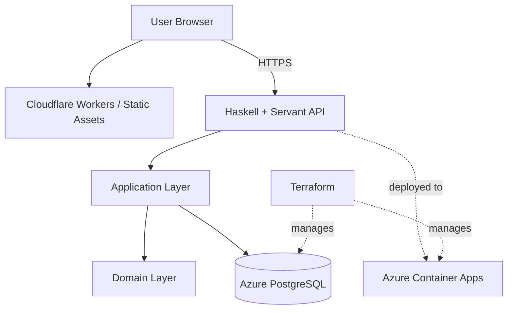

# FlowForge

FlowForge is a multi-tenant workflow platform for defining, executing, and auditing structured business processes.

- **Live Demo**: [https://flowforge.prathamraj.workers.dev](https://flowforge.prathamraj.workers.dev)
- **Status**: Production foundation deployed

## What is FlowForge?
In many businesses, critical processes—such as employee onboarding, purchase requests, and leave approvals—are tracked via chaotic email chains and spreadsheets. FlowForge replaces this manual coordination with a reliable automation platform.

FlowForge allows business teams to define strict operational states, ensure only authorized personnel can execute transitions, and automatically audit every step. It is built to securely isolate data between tenants while guaranteeing safe concurrent execution without data loss.

## Current Capabilities
- **Authentication & Multi-Tenancy**: Secure registration, login, and tenant isolation using workspaces.
- **Role-Based Access Control (RBAC)**: Support for Admin, Manager, Member, and Viewer roles scoped per workspace.
- **Workflow State Machine Engine**: The backend supports arbitrary, graph-based state definitions and transitions.
- **Workflow Execution**: Users can instantiate workflow runs and safely progress them through explicitly defined transitions.
- **Optimistic Concurrency**: Prevents race conditions and lost updates by enforcing "expected versioning" during state transitions.
- **Audit Trails**: Every transition automatically generates an immutable audit event tracking who performed the action and when.
- **User-Friendly Error Handling**: Raw HTTP errors are seamlessly mapped into friendly, actionable UI feedback.
- **Cloud-Native Deployment**: Completely automated deployments using Cloudflare Workers (Frontend), Azure Container Apps (Backend), and Azure Postgres.

## Product Experience
1. **Register/Login** to automatically provision a secure Workspace.
2. **Dashboard** provides a clean overview of workflow metrics and states.
3. **Workflows** allow admins to create new operational flows. (Currently, the UI provisions a standard `Draft` → `In Review` → `Approved` state machine to demonstrate the engine capabilities).
4. **Instances** execute a specific workflow, allowing authorized users to advance steps.
5. **Audit** views provide an immutable history of all instance activities.

## Engineering Highlights
### Multi-Tenancy & Authorization Boundaries
FlowForge enforces hard data isolation. Users possess `Membership` records binding them to a `Workspace` with a specific `Role`. The backend Servant API verifies workspace context headers against actual database memberships on every request. Resources are strictly scoped to their parent Workspace.

### Optimistic Concurrency
To ensure reliable execution even during simultaneous updates, FlowForge implements an `expectedVersion` check on workflow instances. If two users attempt conflicting transitions simultaneously, the database rejects the latter transaction, and the UI gracefully instructs the user to refresh.

### API & Error Handling
The backend uses Servant to generate strict, type-safe API boundaries. Domain exceptions are explicitly mapped to HTTP status codes, and the React frontend catches these to render consistent, friendly messages (e.g., transforming `HTTP 409 Conflict` into "This workflow changed while you were editing it. Reload the latest version.").

### Immutable Auditability
Every state transition is wrapped in a database transaction that simultaneously mutates the workflow instance and records an immutable `AuditEvent`. This ensures that the audit trail can never fall out of sync with the workflow state.

## Architecture



## Technology Stack

| Area | Technology | Purpose |
|------|------------|---------|
| **Frontend** | React, TypeScript, Vite, Tailwind CSS | Responsive, type-safe SPA |
| **Backend** | Haskell, Servant | Strongly-typed API and domain modeling |
| **Database** | PostgreSQL | Relational persistence and concurrency |
| **Infrastructure** | Terraform, Azure Container Apps, ACR | Immutable, cloud-native deployments |
| **Edge CDN** | Cloudflare Workers | Fast, globally distributed static asset delivery |

## Security Model
- **JWT Sessions**: Short-lived access tokens secure authenticated routes.
- **Context Validation**: Frontend workspace IDs are never implicitly trusted; they are cross-referenced with server-side membership tables.
- **RBAC**: Handlers enforce role requirements (e.g., Viewers cannot execute transitions).
- **Tenant Isolation**: SQL queries invariably include `workspace_id` filters to prevent cross-tenant data leakage.

## Workflow Model — Current vs Next

| Capability | Current Status | Planned |
|------------|----------------|---------|
| **State Machine Engine** | ✅ Implemented (Arbitrary States/Transitions) | |
| **Execution & Auditing** | ✅ Implemented | |
| **Visual Workflow Builder** | ❌ Hardcoded templates in UI | 📍 Planned |
| **Graph-Based (Nodes/Edges)**| ❌ State machine based | 📍 Planned |
| **Immutable Versioning** | ❌ Mutable definitions | 📍 Planned |
| **Cross-Workflow Analytics** | ❌ Single instance views | 📍 Planned |

## Testing & Quality
- **Frontend Tests**: Vitest suite covering UI components and contexts (`npm test -- --run`).
- **Type Safety**: Full TypeScript validation (`npx tsc --noEmit`).
- **Production Build**: Vite optimization step (`npm run build`).
- **Code Cleanliness**: Enforced lack of whitespace errors (`git diff --check`).
- **Backend Build**: Backend compilation is normally validated with Cabal; the current development environment did not have the required Cabal executable available during the latest documentation pass.

## Deployment
- **Frontend**: Source code is bundled via Vite and published to Cloudflare Workers Static Assets (`wrangler.jsonc`).
- **Backend**: Containerized via Docker, pushed to Azure Container Registry (ACR), and orchestrated on Azure Container Apps.
- **Database**: Azure Database for PostgreSQL Flexible Server.
- **Provisioning**: Infrastructure is managed declaratively using Terraform (`infrastructure/terraform/`).

## Repository Structure
```
FlowForge/
├── frontend/             # React SPA, Vite configuration, Tailwind CSS
├── backend/              # Haskell Servant API, Domain logic, Database repositories
├── infrastructure/
│   └── terraform/        # Azure infrastructure as code
├── migrations/           # SQL schema evolution scripts
├── docs/                 # Product, Architecture, and UX documentation
├── wrangler.jsonc        # Cloudflare Workers deployment config
└── README.md             # This file
```

## Local Development
### Frontend
```bash
cd frontend
npm install
npm run dev
```

### Backend
*(Requires GHC and Cabal)*
```bash
cd backend
cabal build
cabal run
```
A `.env` file should be configured referencing `.env.example`.

### Infrastructure
```bash
cd infrastructure/terraform
terraform init
terraform plan
```

## Engineering Decisions
- **Haskell Backend**: Selected to drastically reduce runtime bugs via expressive typing and sum types. The `Servant` library guarantees the API boundary exactly matches the implementation.
- **PostgreSQL Persistence**: Preferred over NoSQL to strictly enforce relational integrity (e.g., an Instance must reference a valid Workflow) and leverage row-level locking for optimistic concurrency.
- **Separation of Concerns**: The backend strictly segregates Domain logic (pure rules) from Application use-cases and Infrastructure (database I/O).

## Current Limitations
- The workflow engine currently leverages a basic state-machine model.
- The visual drag-and-drop graph builder for workflows is planned but not yet implemented.
- Integrations (e.g., Slack, Email webhooks) are on the roadmap for future passes.
